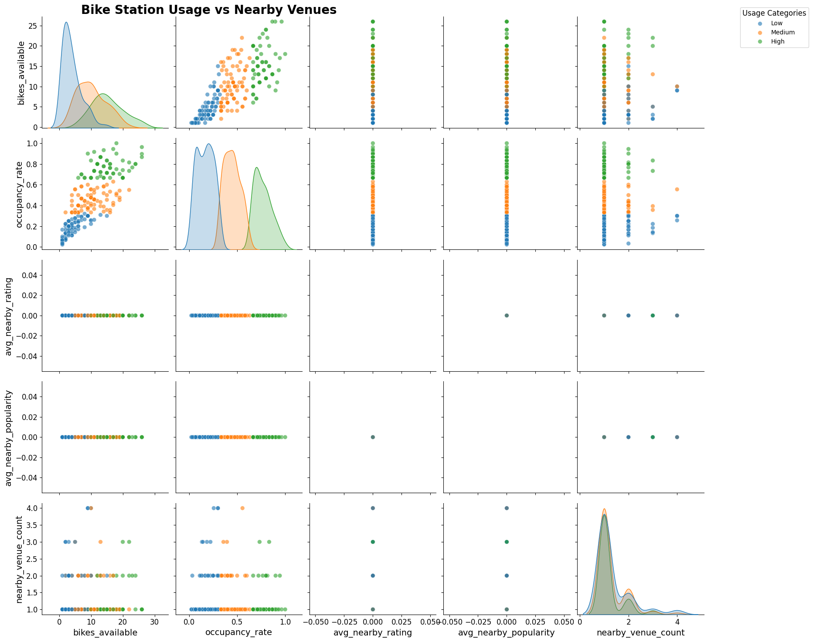
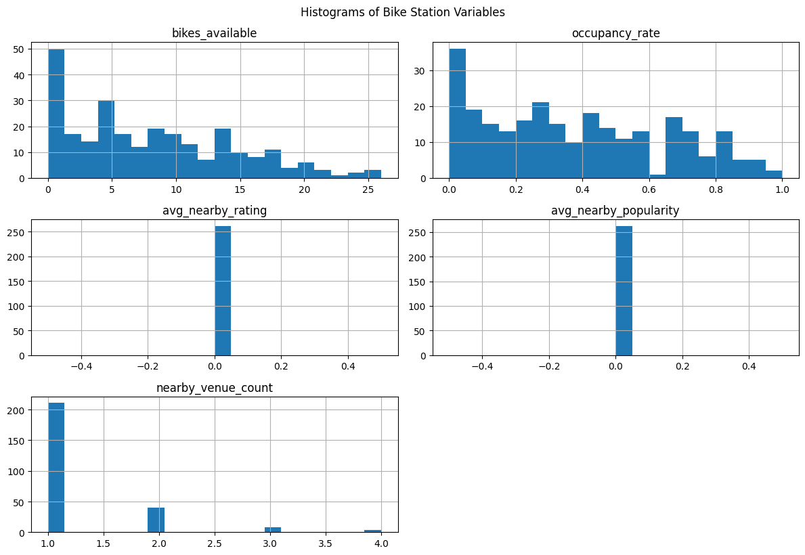
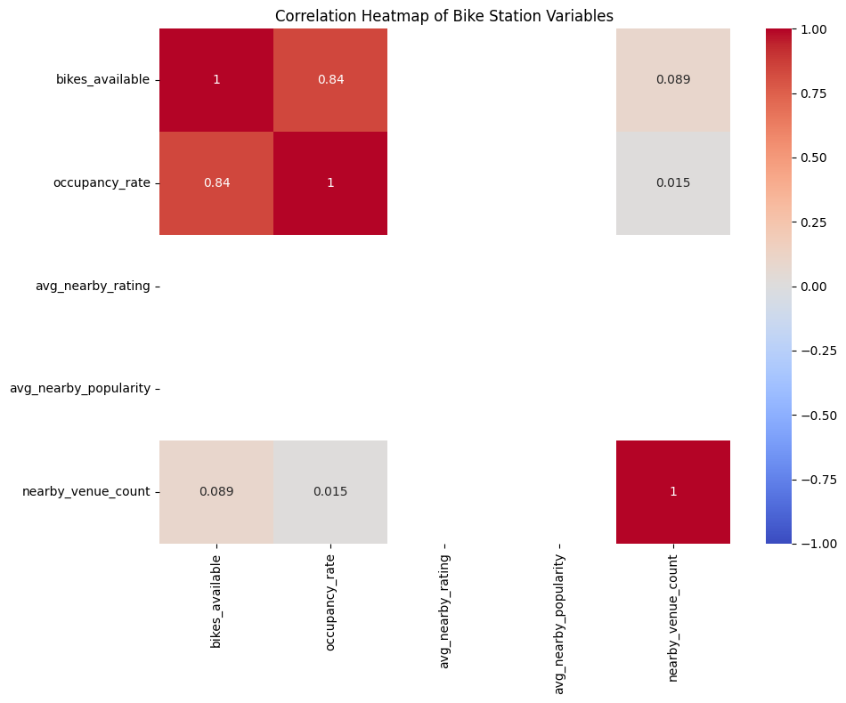
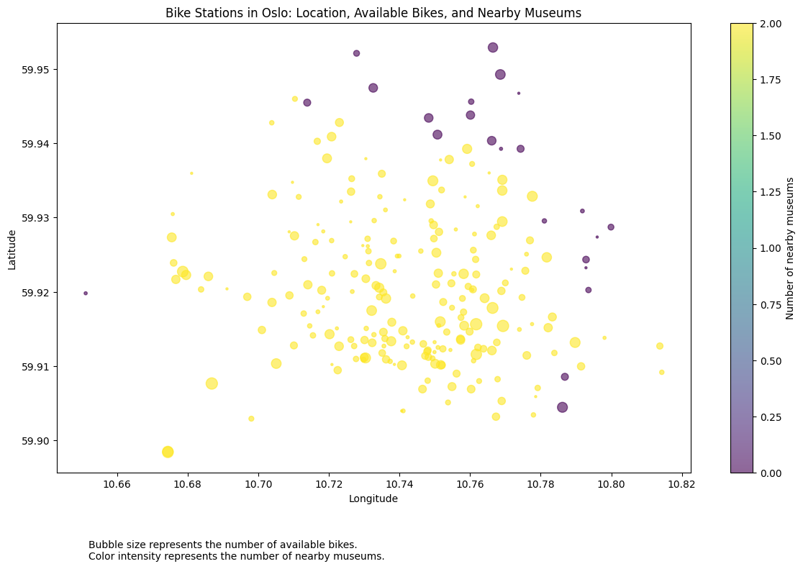
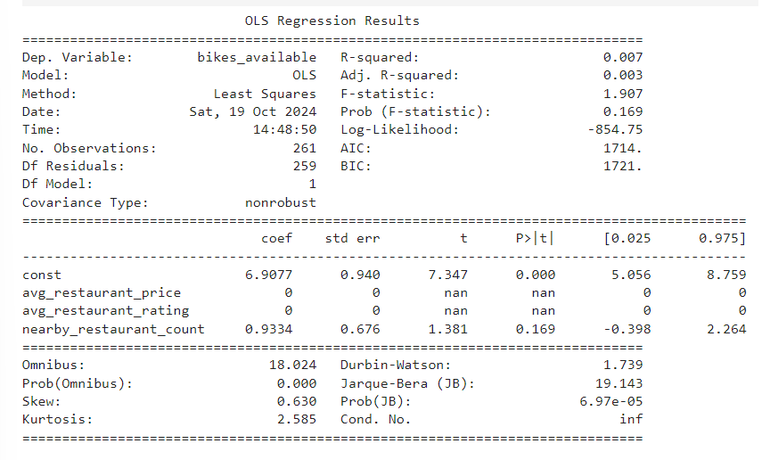
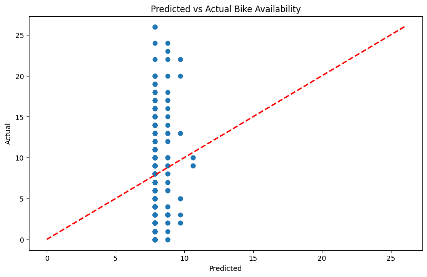

# Statistical Modelling with Python

## :dart: Project/Goals
There were 4 main objectives in given project:
- [x] Connection to the City Bikes API to retrieve bike stations for a specific city.
- [x] Connection to Foursquare and Yelp APIs to retrieve points of interests (POIs) around each bike station.
- [x] Data Parsing, Joining and Exploration of the data retrieved via APIs to gain insights to aid in model building and prediction.
- [x] Model Building – creating a regression model that demonstrates a relationship between the number of bikes or bike usage and the POI characteristics for the location.

## :cityscape: City Selection 
Initially, Copenhagen with it's record-breaking bike culture seemed a good candidate for exploration - unfortunately, CityBikes, the API used, did not have any relevant data for this city. 

Subsequently, the city of Oslo was selected as my location of interest and API calls were made to request information about the Oslo Byssykel bike stations, Norway's capital official bike share program. Since the API call gives the bike station information for only a point in time, the data cannot give a robust picture of bike usage. To mitigate this in a small way, I checked for peak traffic times in Oslo and decided to select a particular time for the API call. Information was received for **263 bike stations**. JSON file was appropriately parsed into Pandas dataframe.

 :pushpin: **JUMP TO:** [city bikes](https://github.com/ankamercier/Python-Statistical-Modelling/blob/main/notebooks/city_bikes.ipynb)

## :framed_picture: Points of Interest
A function was created and utilized to request for POI information from Yelp and Foursquare. POIs selected were the **nearest restaurants/bars and museums**. Parsed results were saved into separate dataframes, created for each API (2x `restobars`, 2x `museums`, total of 4). 

Quality of both APIs was assessed based on retrieved data. 

As a part of an experiment, I compared proximity of bike stations to museums in Oslo. In order to do that, I loop through the data to find closesst POI and sort the results by distance. Radius limit remains the same for both APIs (1000 meters).

In the case of Yelp, API daily call limit was reached - probably due to multiple calls per station, or there might be some redundant calls in the code. Steps taken to mitigate this issue: code review, handling error, temporary solution (request had to be made on separate days).

Both Foursquare and Yelp provided complete data for museums, with zero missing values. However, there are some differences in restaurants & bars data. Yelp has a **staggering 12,915 entries**, with Foursquare returning a modest 263 results.

<details>
<summary>expand for more details</summary>


| API | ENTRIES | MISSING VALUES | ADDITIONAL INFO |
|---------|----------------------|----------------|----------------|
| Foursquare | 263 | 0.38% for \"Rating\"<br>0.76% for \"Price\" | provides \"Popularity\" |
| Yelp | 12,915 | 32.82% for \"Price\" | provides \"Review\" count and \"Rating\" for all entries |

</details>

At first, it seems that Yelp may have a broader coverage in Oslo, but data should be cleaned first before making further assumptions. Yelp is missing price info for about a third of entries.

A **list of top 10 restaurants & bars in Oslo** (bike-accessible) was generated using Yelp data:

| Restaurant Name | Distance to Bike Station | Reviews | Rating |
|-----------------|-------------------------:|--------:|-------:|
| Einer | 257.82 | 5 | 5.0 |
| Bon Lío | 223.40 | 3 | 5.0 |
| Stortorvet Charlies Kebab House | 1229.78 | 2 | 5.0 |
| Erlik Kaffe | 1179.34 | 2 | 5.0 |
| Silk Road | 523.40 | 2 | 5.0 |
| De La Casa Pasta Bar | 372.99 | 2 | 5.0 |
| Norð & Vin | 451.49 | 2 | 5.0 |
| Gioia | 453.52 | 2 | 5.0 |
| Wu Sushi | 525.03 | 3 | 5.0 |
| Emilio's Vinbar | 247.59 | 3 | 5.0 |

> [!NOTE]
> Table was slightly modified for README file, a full version with all columns can be found in EDA notebook.
> 
 :pushpin: **JUMP TO:** [exploratory data analysis](https://github.com/ankamercier/Python-Statistical-Modelling/blob/main/notebooks/yelp_foursquare_EDA.ipynb)

## :magic_wand: Data Parsing & Exploration
Data obtained was parsed into DataFrames, cleaned and explored. Most of the variables were weakly correlated with the dependent variable; a heat map, histogram and pair plot were generated for visualization.

Judging from our columns, it would be interesting to check a correlation between rating/popularity of a restaurant or bar, and bikes available at nearby stations. Foursquare restaurants & bars data was used for this activity.

<details>
  <summary> PAIR PLOT </summary>
  
  
  
</details>
<details>
  <summary> HISTOGRAM </summary>
  
  
  
</details>
<details>
  <summary> HEATMAP </summary>
  
  
  
</details>

A scatterplot resembling a map of Oslo was created as well:



As a future goal, an interactive map can be created. This can be achieved with matplotlib cartopy pillow for static map or folium for interactive map at a later stage. An example: 

 :pushpin: **JUMP TO:** [joining data](https://github.com/ankamercier/Python-Statistical-Modelling/blob/main/notebooks/joining_data.ipynb)

## :building_construction: Model Building
Linear regression model was used to explore relationships. I focused on predicting the *number of available bikes at a station based on POI characteristics* as our main regression model.

Model output:



 :pushpin: **JUMP TO:** [model building](https://github.com/ankamercier/Python-Statistical-Modelling/blob/main/notebooks/model_building.ipynb)

## :white_check_mark: Results

**Model Fit:**
Our R-squared value is 0.007, which is extremely low. This means that only 0.7% of the variance in bike availability is explained by our model. Our chosen predictors are not good.

```
R-squared: 0.0073083621040873625
```

**Statistical Significance:**
p-values indicate that the whole model is not statistically significant, considering common alpha of 0.05

**Coefficients:**
Both `avg_restaurant_price` and `avg_restaurant_rating` are both 0, which is unusual, but considering our previous problem with a database, we know that further cleaning is required for this to work.
Coefficient for `nearby_restaurant_count` is 0.9334, suggesting that for each additional nearby restaurant, we expect an increse of about 0.93 available bikes, but there is no statistical significance here.

```
Coefficients:
const: 6.907740621286713
avg_restaurant_price: 0.0
avg_restaurant_rating: 0.0
nearby_restaurant_count: 0.9333729417755896
```



Overall, current model is not effective at predicting bike availability based on the given restaurant characteristics.

Given these results, it's clear that we need to revisit our data preparation and check for data quality issues. We can also consider other potential predictors that might be more relevant to bike availability.

## :construction: Challenges/Limitations 
- **Daily limit of the Yelp API** lengthened the processing of obtaining the needed information on POIs.
- **Restricted time periods** in Citybikes API only provide a data on bike usage for one point in time, it is in no way a robust picture of the actual bike usage at each station. Studying the trends in bike usage over different time periods (perhaps randomly selected or consistently monitored) would yield more accurate data from which predictions could be achieved.
- **Unfamiliarity** and better knowledge of Oslo (more than one visit) would have enabled exploration of further insights such as comparison of high vs low socio-economic areas, school districts etc.
- **Limited time** spent on a project (3 days to be exact) makes it challenging to create a decent algorithm. More time should be spent on data cleaning.

## :rocket: Future Goals
If I had more time, I would:
- **Change approaches**. Retrieving data for the number of the POIs as well as the proximity to the bike stations.
- **Explore other POIs** such as universities and their relationship to bike usage as well as the presence of parks around bike stations.
- **Create a Time series** exploring seasonality in bike usage.
- Add more fun facts (have you seen any by now? :clown_face:)
